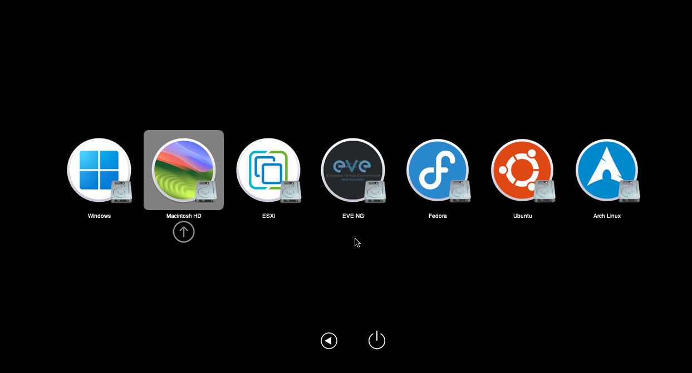
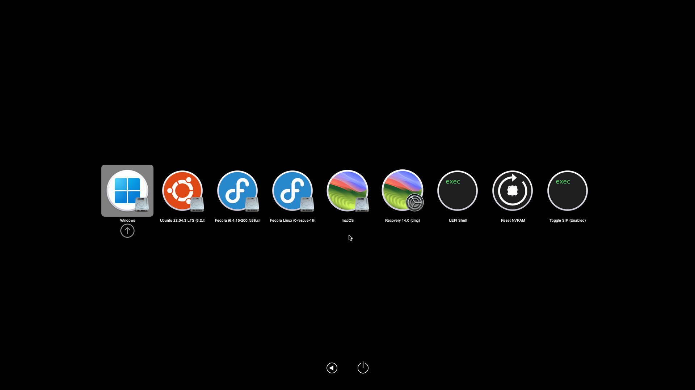

# GoldenGate Extended OpenCore Theme v3.0

GoldenGate Extended is an expanded version of the original **GoldenGate** theme included with OpenCore. It builds on the additional Windows, Linux, and macOS icons created by [eugene28](https://www.insanelymac.com/forum/topic/344251-opencanopy-icons/page/39/#comment-2773461).
 
This version updates and extends the theme with custom icons for macOS Ventura, Sonoma, Sequoia, Tahoe, and older macOS versions from Tiger through El Capitan. It also updates the Windows icons to include Windows 11 and adds additional icons for other operating systems and virtualization platforms.

## Supported OS

<strong>macOS</strong>

- Mac OS X Tiger - Apple10_4 (Added in this version)
- Mac OS X Leopard - Apple10_5 (Added in this version)
- Mac OS X Snow Leopard - Apple10_6 (Added in this version)
- Mac OS X Lion - Apple10_7 (Added in this version)
- OS X Mountain Lion - Apple10_8 (Added in this version)
- OS X Mavericks - Apple10_9 (Added in this version)
- OS X Yosemite - Apple10_10 (Added in this version)
- OS X El Capitan - Apple10_11 (Added in this version)
- macOS Sierra - Apple10_12
- macOS High Sierra - Apple10_13
- macOS Mojave - Apple10_14
- macOS Catalina - Apple10_15
- macOS Big Sur - Apple11
- macOS Monterey - Apple12
- macOS Ventura - Apple13 (Added in this version)
- macOS Sonoma - Apple14 (Added in this version)
- macOS Sequoia - Apple15 (Added in this version)
- macOS Tahoe - Apple26 (Added in this version)

<strong>Linux</strong>

- Linux (Base icon for Linux)
- Arch Linux
- CentOS
- CachyOS
- Debian
- Deepin
- elementary OS
- Endless OS
- Endeavour OS
- Gentoo Linux
- Fedora
- KDE neon
- Kali Linux
- MX Linux
- Mageia (fork of former Mandriva)
- Manjaro
- Linux Mint
- openSUSE
- Pop!_OS
- Red Hat Enterprise Linux
- Rocky Linux
- Solus
- Ubuntu
- Kubuntu
- Lubuntu
- Ubuntu MATE
- UbuntuDDE
- UbuntuCinnamon
- Ubuntu Kylin
- Void Linux
- Xubuntu
- Zorin OS
- ESXi (Added in this version - must be added manually via Misc > Entries)
- EVE-NG (Added in this version - must be added manually via Misc > Entries; otherwise, it may be detected as Ubuntu)
- Proxmox (Added in this version - must be added manually via Misc > Entries)

<strong>Windows</strong>

- Windows 11 - Default icon for all Windows versions (Added in this version)
- Windows Server 2025 (Added in this version - to use it as the default Windows icon, rename the icon file to Windows.icns)
- Windows 10 (Added in this version - to use it as the default Windows icon, rename the icon file to Windows.icns)

## Setup

### Download

Head to [Releases](https://github.com/HJebbour/GoldenGateExt-OpenCore-Theme/releases) page

### config.plist

- Copy "GoldenGateExt" folder to EFI > OC > Resources > Image > Acidanthera
- Misc > Boot > Picker Mode: External
- Misc > Boot > Picker Attributes: 147
- Misc > Boot > Picker Variant: Acidanthera\GoldenGateExt
- Misc > Boot > Show Picker: True

Make sure OpenCanopy.efi is injected in EFI folder and config.plist

## Credits

- Special thanks to [eugene28](https://www.insanelymac.com/forum/topic/344251-opencanopy-icons/page/39/#comment-2773461) for the original extended GoldenGate theme and icons
- [Acidanthera Team](https://github.com/acidanthera)
- [OpenCore Legacy Patcher](https://github.com/dortania/OpenCore-Legacy-Patcher) team for the extended theme concept
- [OpenCanopy Generator](https://github.com/chris1111/OpenCanopy-Generator), created by [chris1111](https://github.com/chris1111), for the PNG to ICNS conversion tool

  

## Preview
    
 

